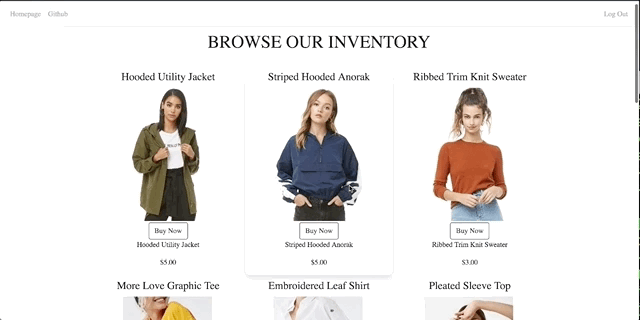
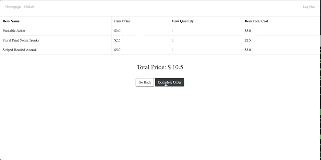

# hackthon-project
Slashed: A marketplace that provides clothing at a discounted rate for people in need. 

Created by: Olivia Ea, Brian Bauer, Levin Weinstein 

## Table of Contents
* [Tech Stack](#techstack) 
* [Setting Up/Installation](#installation)
* [Demo](#demo)


## TechStack
* Frontend: HTML5, JavaScript, Jinja2, Bootstrap 
* Backend: Python, Flask, SQLite3, SQLAlchemy 

## Installation 

Note: Also deployed via Digital Ocean. 
```
http://159.89.154.13:5000/
```

To run Slashed on local computer, follow the below steps:

Clone repository: 
```
$ https://github.com/olivia-ea/hackthon-project.git
```

Set up virtual environment: 

```
$ virtualenv venv
```

Activate virtual envirnoment:
```
$ source venv/bin/activate
```

Install dependencies:
```
$ pip install -r requirements.txt
```

Create your database tables:
```
$ python3 model.py
```

Run from the command line:
```
$ python3 server.py
```

Open localhost:5000 on browser.

## Demo


The user is able to read about the mission statement behind Slashed. 



After the user has created an account or logged into an existing account, they are able to browse the inventory and add to his/her cart.



The user is also able to look at the contents of his/her cart and check out.
